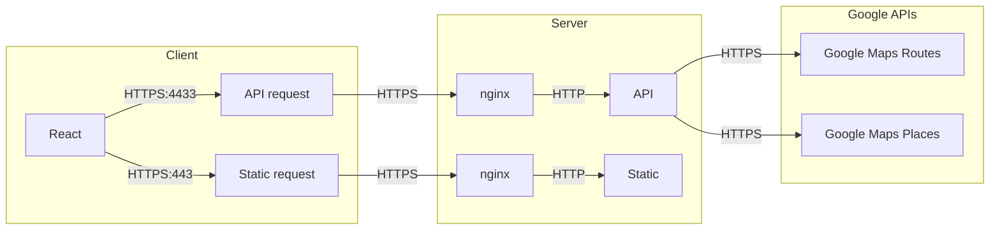

# Start

## System Overview

# End

# Tech Stack Start
|             | backend                 | frontend |
|-------------|-------------------------|----------|
| Language:   | golang + C/C++          | js/ts    |
| Frameworks: | net/http, encoding/json | react    |
| G-Wagon:    | yes                     | no       |

# Infrastructure

